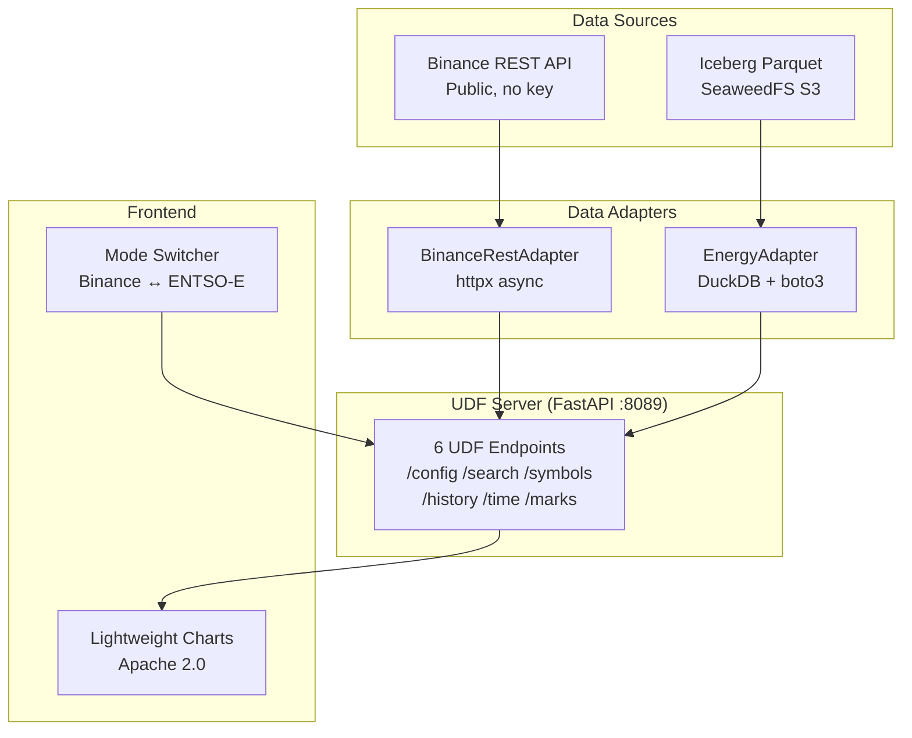

<div align="center">

# TradingView UDF Datafeed Server

### *Binance crypto + ENTSO-E European energy prices — one chart.*

[](https://tradingview.stan-buren.ru/demo/)

<br/>


<br/>

<b>
<a href="#-what-this-project-does">Overview</a> ·
<a href="#-two-modes">Two Modes</a> ·
<a href="#-architecture">Architecture</a> ·
<a href="#-quick-start">Quick Start</a> ·
<a href="#-demo">Live Demo</a> ·
<a href="#-configuration">Configuration</a>
</b>

</div>

<br/>

---

## What this project does

A self-contained datafeed server implementing the TradingView UDF protocol. Two independent data sources, one protocol, one chart widget:

- **🔹 Binance** — 460 USDT spot pairs via public REST API, WebSocket real-time updates
- **⚡ ENTSO-E** — 29 curated European bidding zones, day-ahead electricity prices 2014–2026, EUR/MWh

Seamlessly switch between crypto and energy markets with one click.

---

## Two Modes

```
┌─────────────────────────────────────────────────────────┐
│  TradingView × [Binance ▾| Energy ▾]     ● Connected   │
├─────────────────────────────────────────────────────────┤
│  [BTCUSDT            ]  ← search for crypto            │
│  OR                                                    │
│  [Belgium ▾] [Load Chart]  ← energy zone               │
├─────────────────────────────────────────────────────────┤
│                                                         │
│              📊 CANDLESTICK CHART                       │
│                                                         │
├─────────────────────────────────────────────────────────┤
│  ENTSO-E European electricity prices · EUR/MWh          │
└─────────────────────────────────────────────────────────┘
```

### Binance Mode
Public REST API — no API keys required. 13 resolutions (1m → 1M). 460 USDT spot pairs. WebSocket real-time updates.

### Energy Mode
Apache Iceberg Parquet files from a SeaweedFS S3 lakehouse. DuckDB performs on-the-fly OHLCV aggregation. 29 curated bidding zones. Prices in EUR/MWh. 12 years of historical data. Zones with sparse or broken data are excluded via `_EXCLUDED_ZONES` in the adapter.

---

## Architecture



### Energy data flow

```
ENTSO-E FTP → Landing Zone (S3) → Spark Ingest → Iceberg Parquet
                                                        ↓
                                              DuckDB (on-the-fly OHLCV)
                                                        ↓
                                              UDF Server → Chart
```

---

## Live Demo

**[tradingview.stan-buren.ru/demo/](https://tradingview.stan-buren.ru/demo/)**

Switch to Energy mode, select a zone (try Belgium or France), click Load Chart.

---

## Quick Start

```bash
git clone https://github.com/stan-buren/tradingview-udf-datafeed-server.git
cd tradingview-udf-datafeed-server

# Install dependencies
uv sync

# Configure S3 access (required for Energy mode; skip for Binance-only)
cp .env.example .env
# Edit .env: fill in S3_ENDPOINT, S3_ACCESS_KEY, S3_SECRET_KEY, S3_BUCKET

# Sync Binance symbol database
just sync-symbols

# Start the server
just dev
```

Open **http://localhost:8089/demo**

---

## Configuration

All settings live in `src/udf_server/config.py` with sensible defaults. Override any of them via environment variables or a `.env` file.

| Variable | Default | Description |
|----------|---------|-------------|
| `UDF_PORT` | `8088` | Server port |
| `UDF_HOST` | `0.0.0.0` | Bind address |
| `BINANCE_REST_URL` | `https://api.binance.com` | Binance REST base URL |
| `BINANCE_WS_URL` | `wss://stream.binance.com:9443/ws` | Binance WebSocket URL |
| `BINANCE_REQUEST_TIMEOUT` | `10.0` | HTTP timeout (seconds) |
| `BINANCE_MAX_KLINES_PER_REQUEST` | `1000` | Max bars per Binance call |
| `BINANCE_RATE_LIMIT_RPM` | `1200` | Rate limit (requests/min) |
| `BINANCE_MAX_RETRIES` | `3` | Retries on transient errors |
| `DEFAULT_HISTORY_LIMIT` | `500` | Default bar count |
| `HISTORY_MAX_LIMIT` | `1000` | Hard cap on bar count |
| `SYMBOLS_DB_PATH` | `data/symbols.db` | SQLite cache path |
| `SYMBOL_SYNC_BATCH_SIZE` | `500` | Symbols per batch |
| `SYMBOL_SEARCH_LIMIT` | `100` | Max search results |
| `WS_RECONNECT_DELAY` | `1.0` | WebSocket reconnect base (s) |
| `WS_RECONNECT_MAX_DELAY` | `30.0` | WebSocket max backoff (s) |
| `WS_RECONNECT_BACKOFF` | `2.0` | Exponential backoff multiplier |
| `WS_PING_INTERVAL` | `180.0` | WebSocket keepalive (s) |
| `BAR_CACHE_MAX_BARS` | `2000` | In-memory bar cache |
| `FRONTEND_DIR` | *(auto)* | Path to static demo files |
| `S3_ENDPOINT` | `localhost:8333` | S3-compatible endpoint |
| `S3_ACCESS_KEY` | — | S3 access key |
| `S3_SECRET_KEY` | — | S3 secret key |
| `S3_BUCKET` | `lakehouse-tables` | S3 bucket with Parquet files |
| `ENERGY_PRICE_MIN` | `-500.0` | Price floor (EUR/MWh) |
| `ENERGY_PRICE_MAX` | `3000.0` | Price ceiling (EUR/MWh) |

---

## What This Is NOT

A production trading system. This is a protocol implementation demo demonstrating the UDF protocol, multi-source data adapters, and the TradingView data ecosystem. The frontend uses Lightweight Charts (Apache 2.0, open-source).

---

*Built with curiosity, FastAPI, DuckDB, and a respect for well-designed protocols.*

*V0.2.0 · [Stan Buren](https://github.com/stan-buren) · 2026*
