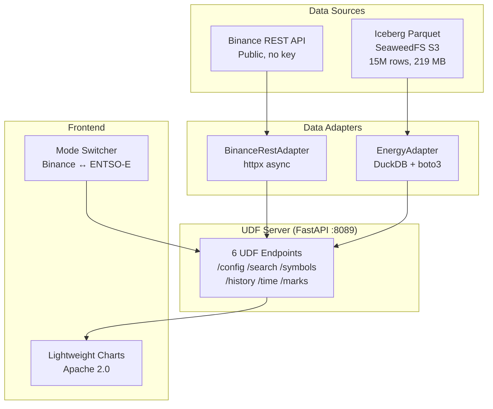

<div align="center">

# TradingView UDF Datafeed Server

### *Binance crypto + ENTSO-E European energy prices in one chart.*

From zero to a fully functional TradingView-compatible datafeed — implementing the UDF protocol spec on bare metal Linux, now with dual data sources.

<br/>


<br/>

<b>
<a href="#-what-this-project-does">Overview</a> ·
<a href="#-two-modes">Two Modes</a> ·
<a href="#-architecture">Architecture</a> ·
<a href="#-quick-start">Quick Start</a> ·
<a href="#-demo">Live Demo</a>
</b>

</div>

<br/>

---

## What this project does

A self-contained datafeed server that speaks the TradingView UDF protocol. Two independent data sources, one protocol, one chart:

- **🔹 Binance** — 460 USDT spot pairs, public REST API, real-time WebSocket
- **⚡ ENTSO-E** — 63 European bidding zones, Day-ahead & Intraday prices, historical data 2014–2026

Same chart widget, seamlessly switching between crypto and energy markets.

---

## Two Modes

```
┌─────────────────────────────────────────────────────────┐
│  TradingView × [Binance ▾| Energy ▾]     ● Connected   │
├─────────────────────────────────────────────────────────┤
│  [BTCUSDT            ]  ← search for crypto            │
│  OR                                                    │
│  [DE-LU ▾] [Day-ahead ▾] [Load Chart]  ← energy zone  │
├─────────────────────────────────────────────────────────┤
│                                                         │
│              📊 CANDLESTICK CHART                       │
│                                                         │
├─────────────────────────────────────────────────────────┤
│  MODE: ENTSO-E  SYMBOL: 10Y1001A1001A82H:DA  RES: 1h   │
└─────────────────────────────────────────────────────────┘
```

### Binance Mode
Public REST API — no API keys. 13 resolutions from 1m to 1M. 460 USDT spot pairs. WebSocket real-time updates.

### Energy Mode
Reads Apache Iceberg Parquet files from a local SeaweedFS S3 lakehouse. DuckDB does on-the-fly OHLCV aggregation. 63 bidding zones across Europe (Albania → Switzerland). Day-ahead and Intraday contracts. 12 years of historical data (2014–2026). Prices in EUR/MWh.

---

## Architecture



### Energy data flow

```
ENTSO-E FTP → Landing Zone (S3) → Spark Ingest → Iceberg Parquet
                                                        ↓
                                              DuckDB (on-the-fly OHLCV)
                                                        ↓
                                              UDF Server → Chart
```

---

## Quick Start

```bash
git clone https://github.com/stan-buren/tradingview-udf-datafeed-server.git
cd tradingview-udf-datafeed-server

# Install
uv sync

# Configure S3 access (for Energy mode — skip for Binance-only)
cp .env.example .env
# Edit .env: S3_ACCESS_KEY, S3_SECRET_KEY, S3_ENDPOINT, S3_BUCKET

# Sync Binance symbols
just sync-symbols

# Start
just dev
```

Open **http://localhost:8089/demo**

---

## Live Demo

**https://tradingview.stan-buren.ru/demo/**

Switch to Energy mode, select a bidding zone (try DE-LU), pick Day-ahead, click Load Chart.

---

## Configuration

| Variable | Default | Description |
|----------|---------|-------------|
| `UDF_PORT` | `8089` | Server port |
| `S3_ENDPOINT` | `192.168.0.93:8333` | SeaweedFS S3 endpoint |
| `S3_ACCESS_KEY` | — | S3 access key |
| `S3_SECRET_KEY` | — | S3 secret key |
| `S3_BUCKET` | `lakehouse-tables` | S3 bucket with Parquet files |

---

## What This Is NOT

Same honesty as before: not a production trading system. It's a protocol implementation demo demonstrating UDF protocol, multi-source data adapters, and the TradingView data ecosystem. The frontend uses Lightweight Charts (Apache 2.0, open-source).

---

*Built with curiosity, FastAPI, DuckDB, and a respect for well-designed protocols.*

*V0.2.0 · [Stan Buren](https://github.com/stan-buren) · 2026*
