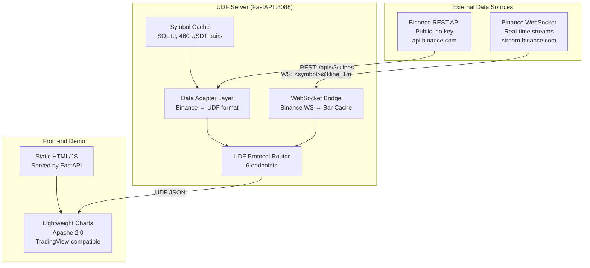
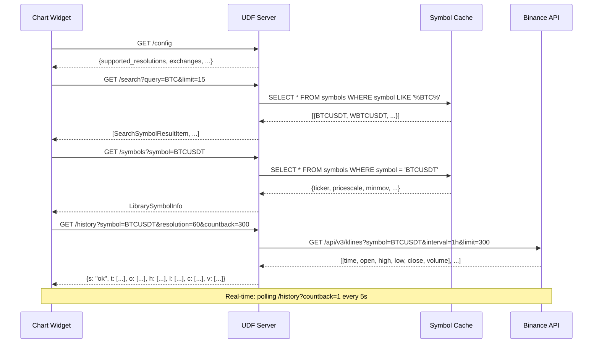

<div align="center">

# TradingView UDF Datafeed Server

### *A protocol-native bridge between Binance market data and TradingView charts.*

From zero to a fully functional TradingView-compatible datafeed — implementing the UDF protocol spec on bare metal Linux.

<br/>

<!-- ═══════════════════════ STACK ═══════════════════════ -->


<!-- ═══════════════════════ VITALS ═══════════════════════ -->


<br/>

<b>
<a href="#-what-this-project-does">Overview</a> ·
<a href="#-the-tradingview-data-ecosystem">Ecosystem</a> ·
<a href="#-architecture">Architecture</a> ·
<a href="#-core-components">Components</a> ·
<a href="#-udf-protocol">UDF Spec</a> ·
<a href="#-project-structure">Structure</a> ·
<a href="#-quick-start">Quick Start</a> ·
<a href="#-what-this-is-not">Honesty</a>
</b>

</div>

<br/>

---

> **Legenda.** TradingView creates the world's most popular financial charts. Their library is used by Binance, Bybit, OKX—virtually all major crypto exchanges. However, the library itself **contains no data**. It requires a "datafeed"—a server that responds to HTTP requests in a strictly defined format. This format is known as the **UDF (Universal Datafeed) protocol**. I implemented it in Python.

---

<br/>

## What this project does

> [!NOTE]
> **Context:** TradingView's charting library is a client-side JavaScript widget. It renders interactive financial charts but contains zero market data. Every chart connects to a **datafeed** — a server-side component that responds to requests for symbols, historical bars, and real-time updates.
>
> The library supports two datafeed protocols: the full **Datafeed API** (JavaScript, WebSocket-native) and the simpler **UDF protocol** (HTTP-based, 6 REST endpoints returning columnar JSON).

> [!WARNING]
> **Problem:** To use TradingView-compatible charts with your own data, you need a backend that speaks the UDF protocol. There is no official Python implementation. This project fills that gap.

**What you get:** A self-contained, documented, testable datafeed server. Clone, run `just dev`, open the browser — live candlestick charts from Binance, rendered with TradingView's own open-source [Lightweight Charts](https://github.com/tradingview/lightweight-charts) library. Zero API keys. Zero configuration.

<br/>

## The TradingView Data Ecosystem

Before writing a single line of code, I mapped the entire landscape:

```
┌─────────────────────────────────────────────────┐
│            TRADINGVIEW ECOSYSTEM                │
│                                                 │
│  ┌──────────────────┐   ┌────────────────────┐  │
│  │ Advanced Charts  │   │  Trading Platform  │  │
│  │ (Proprietary)    │   │  (Paid license)    │  │
│  └────────┬─────────┘   └─────────┬──────────┘  │
│           │                       │             │
│           └───────────┬───────────┘             │
│                       │                         │
│              ┌────────▼────────┐                │
│              │   DATAFEED      │                │
│              │  (JavaScript)   │                │
│              │                 │                │
│     ┌────────┤ • Datafeed API  ├────────┐       │
│     │        │ • UDF Adapter   │        │       │
│     │        └─────────────────┘        │       │
│     │                                   │       │
│  ┌──▼──────────────┐         ┌──────────▼────┐  │
│  │ Datafeed API     │         │  UDF Protocol │  │
│  │ (JS methods)     │         │  (HTTP REST)  │  │
│  │ onReady()        │         │  GET /config  │  │
│  │ resolveSymbol()  │         │  GET /symbols │  │
│  │ getBars()        │         │  GET /history │  │
│  │ subscribeBars()  │         │  GET /search  │  │
│  └──────────────────┘         │  GET /time    │  │
│                               └───────┬───────┘  │
│                                       │          │
│                              ┌────────▼────────┐ │
│                              │  THIS PROJECT   │ │
│                              │  Python/FastAPI │ │
│                              │  UDF Server     │ │
│                              └─────────────────┘ │
└─────────────────────────────────────────────────┘
```

### What APIs actually exist

| API | Type | Free? | What it does |
|-----|------|-------|-------------|
| **Charting Library** | JS widget | ❌ Company license | Interactive charts in browser |
| **Trading Platform** | JS widget | ❌ Paid only | Charts + broker + trading |
| **Lightweight Charts** | JS library | ✅ Apache 2.0 | Open-source candlestick charts |
| **Datafeed API** | JS protocol spec | ✅ Public docs | 6 JS methods contract |
| **UDF Protocol** | HTTP spec | ✅ Public docs | 6 REST endpoint contract |
| **Pine Script** | Language | ✅ Free on site | Indicators/strategies on tradingview.com |
| **tradingview.com REST** | Internal API | ❌ Undocumented | What their website uses internally |

**Bottom line:** TradingView provides a *chart widget* and a *protocol spec*. Market data is your responsibility. This project bridges Binance → UDF → charts.

<br/>

## Architecture

Three-layer design, running on my bare metal home server (HP EliteDesk 800 G3):



### Data flow: what happens when you load a chart



<br/>

## Core Components

<table>
<tr>
<td width="30"><h3>1</h3></td>
<td>

**UDF Protocol Router** ([`src/udf_server/router/`](src/udf_server/router/)) — 6 HTTP endpoints implementing the TradingView UDF specification exactly. Every endpoint returns JSON in columnar "response-as-a-table" format. Handles `nextTime` for market gaps, `countback` semantics, and proper error codes (`s: "error"` + `errmsg`).

</td>
</tr>
<tr>
<td><h3>2</h3></td>
<td>

**Binance Data Adapter** ([`src/udf_server/adapter/binance_rest.py`](src/udf_server/adapter/binance_rest.py)) — Translates Binance kline arrays to UDF columnar format. Maps 13 resolutions (`1m`→`"1"`, `1h`→`"60"`, `1d`→`"1D"`), converts ms→seconds timestamps, handles `countback` (Binance lacks `from` parameter — we fetch `limit` bars and filter). Retries with exponential backoff on 429/5xx. Zero API keys.

</td>
</tr>
<tr>
<td><h3>3</h3></td>
<td>

**Symbol Cache** ([`src/udf_server/cache/symbol_store.py`](src/udf_server/cache/symbol_store.py)) — SQLite database of 460 USDT spot trading pairs from Binance. Populated on first `just sync-symbols`. Sub-millisecond lookup for `/symbols`, `/search`, and `/symbol_info`. Read-only at runtime — no write contention. Portable single file (`data/symbols.db`).

</td>
</tr>
<tr>
<td><h3>4</h3></td>
<td>

**WebSocket Bridge** ([`src/udf_server/adapter/binance_ws.py`](src/udf_server/adapter/binance_ws.py)) — Persistent WebSocket connections to Binance for real-time kline streams. Subscribes on demand (`<symbol>@kline_<interval>`). Updates pushed to in-memory `BarCache`. Exponential backoff reconnection (1s → 30s max).

</td>
</tr>
<tr>
<td><h3>5</h3></td>
<td>

**Lightweight Charts Frontend** ([`frontend/`](frontend/)) — Single-page demo with TradingView's open-source charting library. Full flow: symbol search → load → historical bars → real-time polling. Self-contained: chart library bundled locally (164 KB), zero CDN dependencies.

</td>
</tr>
</table>

<br/>

## UDF Protocol

Six endpoints. Every TradingView-compatible chart expects these:

### `GET /config`
Datafeed capabilities: resolutions, exchanges, symbol types.

### `GET /search?query=<str>&limit=<int>`
Symbol search as user types. Returns `[{symbol, ticker, description, exchange, type}]`.

### `GET /symbols?symbol=<ticker>`
Resolve symbol → full `LibrarySymbolInfo` (pricescale, minmov, session, timezone, intraday multipliers, etc.).

### `GET /history?symbol=<ticker>&resolution=<str>&from=<unix>&to=<unix>&countback=<int>`
The core endpoint. Returns OHLCV bars in columnar format:
```json
{"s": "ok", "t": [1710374400, ...], "c": [42100.5, ...], "o": [...], "h": [...], "l": [...], "v": [...]}
```
Edge cases: `s: "no_data"` + `nextTime` for gaps, `s: "error"` + `errmsg` for failures, `countback` priority over `from`.

### `GET /time`
Unix timestamp. Used for clock drift detection.

### `GET /marks?symbol=<ticker>&from=<unix>&to=<unix>`
Chart markers (news, events). Stub — reserved for future.

<br/>

## Project Structure

```
tradingview/
├── 📄 README.md                          ← Project overview & UDF protocol spec
├── 📄 AGENTS.md                          ← Repository guidelines for contributors & AI
├── 📄 pyproject.toml                     ← uv project config + dependencies
├── 📄 justfile                           ← Task runner (dev, test, sync-symbols, fmt, lint)
├── 📄 .python-version                    ← Python 3.12
├── 📄 .env                               ← All configurable values (commented defaults)
├── 📄 .gitignore
│
├── 🐍 src/udf_server/                    ← UDF PROTOCOL IMPLEMENTATION
│   ├── __init__.py
│   ├── main.py                           ← FastAPI app + lifespan
│   ├── config.py                         ← SSOT: all constants, env-overridable
│   ├── router/
│   │   ├── __init__.py
│   │   ├── config_route.py               ← GET /config
│   │   ├── search_route.py               ← GET /search
│   │   ├── symbols_route.py              ← GET /symbols, GET /symbol_info
│   │   ├── history_route.py              ← GET /history
│   │   ├── time_route.py                 ← GET /time
│   │   └── marks_route.py                ← GET /marks (stub)
│   ├── adapter/
│   │   ├── __init__.py
│   │   ├── binance_rest.py               ← Binance REST → UDF format
│   │   ├── binance_ws.py                 ← WebSocket stream → bar cache
│   │   └── resolution.py                 ← Resolution mapping: 1m→"1", 1h→"60"
│   ├── cache/
│   │   ├── __init__.py
│   │   ├── symbol_store.py               ← SQLite read/write
│   │   └── bar_cache.py                  ← In-memory rolling bar cache
│   └── models/
│       ├── __init__.py
│       ├── symbol.py                     ← DatafeedConfiguration, LibrarySymbolInfo
│       └── bar.py                        ← Bar, HistoryResponse
│
├── 🌐 frontend/                          ← LIGHTWEIGHT CHARTS DEMO
│   ├── index.html                        ← Chart page with search + real-time
│   ├── style.css                         ← Dark theme
│   └── lightweight-charts.standalone.production.js  ← Bundled locally (164 KB)
│
├── 🗄️ data/                              ← SQLite databases (gitignored)
│   └── symbols.db                        ← Binance symbol cache
│
├── 🐳 docker/                            ← DOCKER DEPLOYMENT
│   ├── Dockerfile                        ← Multi-stage Python 3.12-slim
│   ├── docker-compose.yml                ← UDF server
│   ├── .dockerignore
│   └── udf-server.service               ← systemd unit for bare metal
│
├── 📄 docs/                              ← Implementation decisions & architecture notes
│   └── implementation.md
│
└── 🧪 tests/                             ← TEST SUITE (25 tests)
    ├── __init__.py
    ├── conftest.py                       ← Fixtures: mock Binance, test client
    ├── test_bar_models.py
    ├── test_binance_adapter.py
    ├── test_resolution.py
    └── test_symbol_cache.py
```

<br/>

## Quick Start

### Prerequisites

- Python 3.12+
- [uv](https://docs.astral.sh/uv/) package manager
- [just](https://github.com/casey/just) command runner (optional — all commands also work with `uv run` directly)

### One command to run

```bash
git clone https://github.com/stan-buren/tradingview-udf-server.git
cd tradingview-udf-server

# Install dependencies
uv sync

# Sync Binance symbols to local cache (~2 seconds, 460 USDT pairs)
just sync-symbols

# Start everything
just dev
```

Open **http://localhost:8088/demo** — you'll see a dark TradingView-style chart. Type `BTCUSDT` in the search box, hit Enter. Live candlestick chart from Binance.

That's it. No API keys. No configuration. No external dependencies at runtime.

### What `just dev` does

| Port | Path | What |
|------|------|------|
| 8088 | `/config` | UDF datafeed capabilities |
| 8088 | `/search?query=BTC` | Symbol search |
| 8088 | `/symbols?symbol=BTCUSDT` | Symbol metadata |
| 8088 | `/history?symbol=BTCUSDT&resolution=60&countback=300` | OHLCV bars |
| 8088 | `/time` | Server timestamp |
| 8088 | `/health` | Health check |
| 8088 | `/demo` | Interactive chart frontend |

### Other commands

```bash
just test           # Run 25 tests with coverage
just fmt            # Format code (Ruff)
just lint           # Lint code (Ruff)
just sync-symbols   # Refresh Binance symbol cache
just clean          # Remove build artifacts
```

### Docker

```bash
docker compose -f docker/docker-compose.yml up --build
# Server at http://localhost:8088
```

### Bare metal (systemd)

```bash
just install-service
sudo systemctl start udf-server
```

<br/>

## Configuration

Every hardcoded value lives in a single file: [`src/udf_server/config.py`](src/udf_server/config.py). Each constant can be overridden by an environment variable of the same name.

See [`.env`](.env) for all available options with commented defaults. Uncomment any line to override.

| Variable | Default | Description |
|----------|---------|-------------|
| `UDF_PORT` | `8088` | Server port |
| `BINANCE_REST_URL` | `https://api.binance.com` | Binance REST base URL |
| `BINANCE_WS_URL` | `wss://stream.binance.com:9443/ws` | Binance WebSocket URL |
| `SYMBOLS_DB_PATH` | `data/symbols.db` | SQLite cache location |
| `DEFAULT_HISTORY_LIMIT` | `500` | Default bars per history request |
| `BAR_CACHE_MAX_BARS` | `2000` | Max bars cached per symbol+resolution |
| `BINANCE_MAX_RETRIES` | `3` | Max retries on HTTP failures |

<br/>

## What This Is NOT

> [!IMPORTANT]
> **Honest disclosure for anyone reviewing this (including TradingView recruiters):**

1. **Not a production trading system.** It's a protocol implementation demo — demonstrating UDF protocol, REST API design, WebSocket streaming, and the TradingView data ecosystem.

2. **Does not use the proprietary TradingView Charting Library.** The frontend uses [Lightweight Charts](https://github.com/tradingview/lightweight-charts) (Apache 2.0, open-source, built by the same team). The UDF server is protocol-compatible — plug in a licensed TradingView widget and it works.

3. **Uses only public APIs.** Binance spot market data is publicly available. No API keys, no authentication.

4. **The UDF protocol is publicly documented.** Every endpoint format is specified in TradingView's [official docs](https://www.tradingview.com/charting-library-docs/latest/connecting_data/UDF). Zero reverse engineering.

5. **"Bare metal Linux server"?** Yes — HP EliteDesk 800 G3, 32 GB RAM, 2 TB SSD. Hosts my [ENTS-O-E data platform](https://github.com/stan-buren/entsoe-quickstart), [MLOps factory](https://github.com/stan-buren/n-cmapss-rul-mlops-factory), and now this. The datafeed integrates with my existing Docker Compose network.

<br/>

---

## Epilogue

<div align="center">

This project started as a question: *"How does TradingView actually get its data?"*

I was a daily user of the platform and wanted to understand what happens under the hood when a chart loads. Turns out, the contract between the chart widget and the data server is a clean, well-designed HTTP protocol — 6 endpoints, columnar JSON, and a thoughtful approach to real-time updates.

Building a compliant implementation took focused work: reading the protocol spec, mapping Binance's REST/WebSocket APIs to UDF format, and handling edge cases like market gaps, resolution aliasing, and connection resilience.

The result is a self-contained, documented, testable datafeed server — the same protocol spoken by the charts on Binance, Bybit, and OKX.

<br/>

**Next steps I'm considering:**
- Multiple exchanges via adapter pattern (Bybit, Kraken)
- SSE push for real-time (currently polling)
- `getMarks` for on-chain events and news
- Full Datafeed API implementation (WebSocket-native)
- Pine Script-compatible indicator engine

<br/>

*Built with curiosity, FastAPI, and a respect for well-designed protocols.*

<br/>

<sub>V0.1.0 · [Stan Buren](https://github.com/stan-buren) · 2026</sub>

</div>
